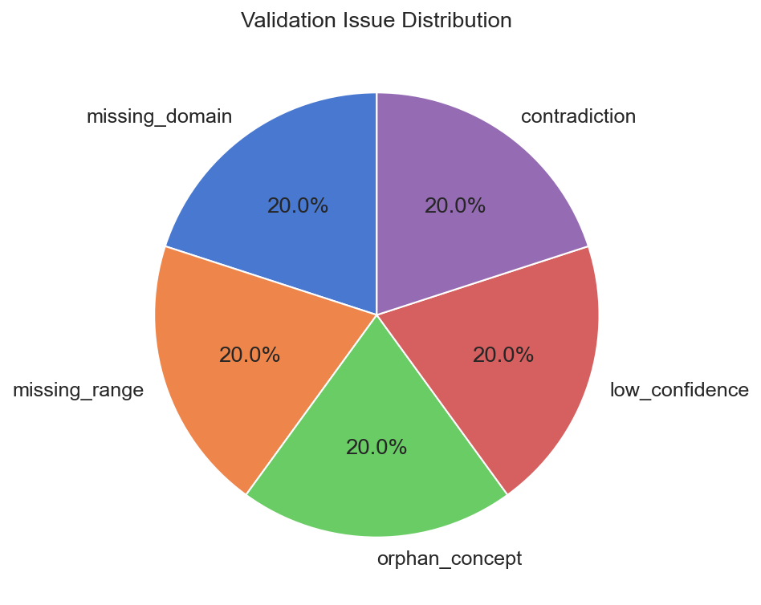
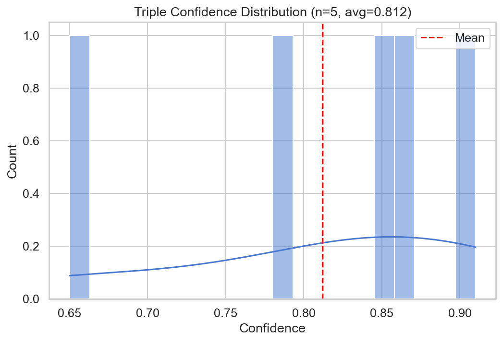
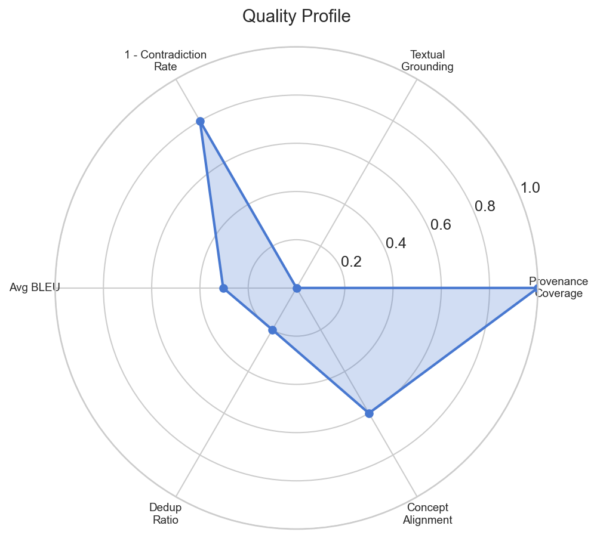
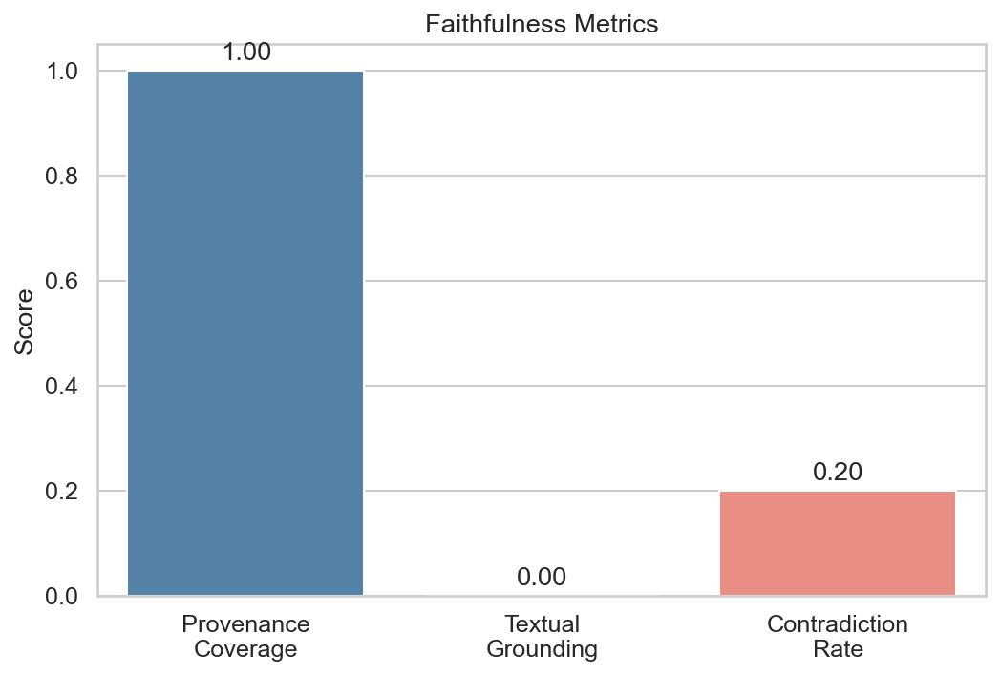

# NeoOLAF - Evaluation Results Explained

> This document explains in detail each result produced by `tests/test_evaluation.py`
> using fake data simulating a maintenance report about a bearing failure in a motor.

---

## Fake Data Used

The source text simulates a technical report:
> "The bearing failure caused overheating in the motor assembly.
> Vibration analysis detected misalignment. The shaft seal was worn.
> Temperature sensors recorded abnormal readings above 120 degrees."

**8 predicted entities**: BearingFailure, Overheating, MotorAssembly, VibrationAnalysis,
Misalignment, ShaftSeal, TemperatureSensor, CoolingSystem

**8 gold entities**: the first 7 + LubricationPump (missing from predictions)

**5 predicted triples**, **4 gold triples**, **5 concepts**, **3 ontology relations**,
**4 axioms**, **5 validation issues**, **2 completions**.

---

## 1. Entity Metrics (Benchmark with Gold Standard)

### Results

| Mode     | Precision | Recall | F1     |
|----------|-----------|--------|--------|
| Exact    | 0.875     | 0.875  | 0.875  |
| Fuzzy    | 0.875     | 0.875  | 0.875  |
| Partial  | 0.875     | 0.875  | 0.875  |

### Interpretation

- **7 True Positives**: BearingFailure, Overheating, MotorAssembly, VibrationAnalysis,
  Misalignment, ShaftSeal, TemperatureSensor -- all correctly found.
- **1 False Positive**: `CoolingSystem` -- the pipeline extracted this entity but
  it does not exist in the gold standard. This is a pipeline "hallucination".
- **1 False Negative**: `LubricationPump` -- this entity exists in the gold standard
  but the pipeline did not detect it. The source text does not mention it
  explicitly, so this is an expected "miss".

**Why Exact = Fuzzy = Partial?** Because our fake labels are identical
between predictions and gold (e.g., "BearingFailure" vs "BearingFailure"). In real-world
conditions, Fuzzy and Partial would be higher as they tolerate variations
("Bearing_Failure" vs "BearingFailure").

### Per Entity Type

| Type      | F1   | Explanation |
|-----------|------|-------------|
| event     | 1.0  | BearingFailure and Overheating both found |
| symptom   | 1.0  | Misalignment correctly identified |
| process   | 1.0  | VibrationAnalysis correctly identified |
| component | 0.75 | 3 out of 4 found. CoolingSystem is a FP, LubricationPump is a FN |

**Conclusion**: The pipeline is excellent on events/symptoms/processes
but slightly less accurate on components (it invents CoolingSystem and misses LubricationPump).

---

## 2. Relation Metrics (Benchmark with Gold Standard)

### Results

| Mode           | Precision | Recall | F1     |
|----------------|-----------|--------|--------|
| Strict         | 0.600     | 0.750  | 0.667  |
| Fuzzy          | 0.600     | 0.750  | 0.667  |
| Relaxed        | 0.600     | 0.750  | 0.667  |
| Predicate Only | 1.000     | 0.750  | 0.857  |

### Interpretation

**3 Matched** (correctly found):
- (BearingFailure, causes, Overheating) -- exact match with gold
- (VibrationAnalysis, detects, Misalignment) -- exact match
- (ShaftSeal, partOf, MotorAssembly) -- exact match

**1 Missed** (in gold but not predicted):
- (TemperatureSensor, **monitors**, MotorAssembly) -- the predicate "monitors"
  was never generated by the pipeline. The pipeline created "detects" instead.

**2 Extra** (predicted but not in gold):
- (TemperatureSensor, detects, Overheating) -- invented relation, the gold
  expects "monitors" not "detects"
- (BearingFailure, causes, Misalignment) -- contradictory relation with t-1,
  the gold does not recognize this relation

**Why Precision = 0.60?** Out of 5 predicted triples, only 3 are correct = 3/5.

**Why Recall = 0.75?** Out of 4 gold triples, 3 were found = 3/4.

**Why Predicate Only F1 = 0.857?** This mode compares only predicates
(causes, detects, partOf). All 3 predicted predicates exist in the gold,
but "monitors" from the gold was not predicted. Precision = 3/3 = 1.0, Recall = 3/4 = 0.75.

---

## 3. Ontology Conformance (Benchmark with Gold Standard)

### Results

| Aspect           | Precision | Recall | F1     |
|------------------|-----------|--------|--------|
| Concept Coverage | 1.000     | 0.833  | 0.909  |
| Hierarchy        | 1.000     | 1.000  | 1.000  |
| Domain/Range     | 1.000     | 1.000  | 1.000  |

### Interpretation

**Concepts (5 predicted, 6 gold)**:
- All 5 predicted concepts (FailureEvent, MechanicalComponent, Symptom,
  DiagnosticProcess, BearingDefect) match the gold = 100% Precision
- But `LubricationSystem` from the gold was not generated = 83.3% Recall
- The matching uses fuzzy: "MechanicalComponent" matches "MechanicalComponent"
  in the gold thanks to similarity (score > 85)

**Hierarchy (2 predicted, 2 gold)**:
- (BearingDefect, FailureEvent) and (Symptom, FailureEvent) -- both
  hierarchy links are perfectly correct = F1 100%

**Domain/Range (1 predicted, 1 gold)**:
- (causes, domain=FailureEvent, range=Symptom) -- matches the gold exactly

**Structural metrics**:
- **Structural depth**: predicted=0.40, gold=0.33 -- the predicted ontology is
  slightly deeper because 2/5 concepts have a parent vs 2/6 in the gold
- **Orphan ratio**: predicted=0.60, gold=0.67 -- 3 out of 5 concepts are orphans
  (DiagnosticProcess, MechanicalComponent, FailureEvent have no parent)

---

## 4. Validation Outcomes (No Gold Standard)

### Results

| Metric                 | Value   |
|------------------------|---------|
| Status                 | INVALID |
| Total issues           | 5       |
| Errors                 | 2       |
| Warnings               | 3       |
| Avg triple confidence  | 0.812   |
| Dedup ratio            | 20%     |
| Orphan concept ratio   | 60%     |
| Domain/range coverage  | 33.3%   |

### Interpretation

**Why INVALID?** The Layer 10 ValidationReport detected 2 errors:
1. `low_confidence`: triple t-5 (BearingFailure causes Misalignment)
   has a confidence of 0.65, below the acceptable threshold
2. `contradiction`: triples t-1 and t-5 share the same (subject, predicate)
   but have different objects (Overheating vs Misalignment)

**3 Warnings**:
- `missing_domain`: the relation "detects" has no domain axiom
- `missing_range`: the relation "detects" has no range axiom
- `orphan_concept`: "DiagnosticProcess" has no parent in the hierarchy

**Dedup ratio = 20%**: 1 inferred triple / 5 candidate triples. The reasoning
only produced one new triple via transitive inference.

**Orphan concept ratio = 60%**: 3 out of 5 concepts (FailureEvent, MechanicalComponent,
DiagnosticProcess) have no parent in the hierarchy. This is high -- ideally
only the root concept should be an orphan.

**Domain/range coverage = 33.3%**: only 1 relation out of 3 (causes) has both
domain AND range axioms. "detects" and "partOf" do not.

---

## 5. Faithfulness (No Gold Standard)

### Results

| Metric                 | Value              |
|------------------------|--------------------|
| Provenance coverage    | 100%               |
| Textual grounding rate | 0%                 |
| Contradiction rate     | 20%                |
| Contradiction pairs    | 1 (t-1 vs t-5)    |

### Interpretation

**Provenance coverage = 100%**: All 5 triples have at least one evidence snippet
attached. The pipeline successfully linked each triple to a source text passage.

**Textual grounding rate = 0%**: No triple is considered "grounded".
To be grounded, both the **subject** AND the **object** of the triple must appear
textually in the evidence snippet. Examples:
- t-1: snippet = "The bearing failure caused overheating in the motor assembly."
  - subject "BearingFailure": we search for "bearingfailure" in the normalized snippet...
    the text contains "bearing failure" (2 words) but the label is "bearingfailure"
    (1 word) -> the substring matching does not find "bearingfailure" in "bearing failure"
  - This is why the grounding fails: CamelCase labels do not match
    the natural language text with spaces

**This is a realistic behavior**: in production, you would need to either normalize
the labels (CamelCase -> spaces) or use a more flexible matching approach.

**Contradiction rate = 20%**: 1 contradictory pair out of 5 triples.
- t-1: (BearingFailure, causes, **Overheating**)
- t-5: (BearingFailure, causes, **Misalignment**)
- Same subject+predicate but different objects = potential contradiction

---

## 6. BLEU Scores (No Gold Standard)

### Results

| Statistic       | Value  |
|-----------------|--------|
| Pairs evaluated | 9      |
| Avg BLEU        | 0.3039 |
| Median BLEU     | 0.1122 |
| Min BLEU        | 0.0    |
| Max BLEU        | 1.0    |
| Low BLEU items  | 6      |

### Interpretation

The BLEU score measures the similarity between a triple/axiom's **justification**
and its associated **evidence snippet**. A high BLEU means the justification
faithfully reproduces the source text.

- **Max = 1.0**: at least one item has a justification identical to its snippet
  (e.g., t-1 whose justification IS the snippet)
- **Min = 0.0**: some items have zero n-gram overlap
- **Median = 0.11**: most justifications are rephrased rather
  than copied from the source text
- **6 items below the 0.2 threshold**: notably t-3, t-5, and the 4 axioms
  (ax-1 to ax-4) whose justifications are synthetic sentences
  like "causes has domain FailureEvent" that do not resemble the source text

**This is expected**: axioms are abstract ontological constructs,
not text citations. A low BLEU on axioms is not a problem.

---

## 7. Ontology Alignment (No Gold Standard)

### Results

| Category        | Total | Aligned | Rate  |
|-----------------|-------|---------|-------|
| Concepts        | 5     | 3       | 60.0% |
| Relations       | 3     | 2       | 66.7% |
| Hierarchy links | 2     | 1       | 50.0% |

### Interpretation

The alignment compares the generated ontology to an **external reference ontology**
(not a gold standard, but an existing domain ontology).

**Aligned concepts (3/5)**:
- FailureEvent <-> FailureMode (score 0.84): semantically close labels
- MechanicalComponent <-> MechanicalPart (score 0.83): suffix variation
- Symptom <-> Symptom (score 1.0): identical

**Unaligned concepts (2/5)**:
- `DiagnosticProcess`: no equivalent in the reference (which does not have
  a similar concept like "AnalysisProcess" with a sufficient score)
- `BearingDefect`: the reference has "BearingFault" but the fuzzy score
  does not reach the 80 threshold

**Aligned relations (2/3)**:
- causes <-> causeOf (score 0.91): very close
- partOf <-> isPartOf (score 1.0 via partial match)

**Unaligned relation**:
- `detects`: the reference has "identifies" but the fuzzy score is too low

**Hierarchy (1/2)**: only the link (BearingDefect->FailureEvent) roughly aligns
with (BearingFault->FailureMode) from the reference.

---

## 8. Plot Interpretation

### 8.1. Validation Issue Distribution (Pie Chart)



Each issue type represents **20%** (1/5). The distribution is perfectly
uniform, meaning the problems are diversified:
- **missing_domain** and **missing_range** (40% combined): axiom incompleteness
- **orphan_concept** (20%): hierarchy problem
- **low_confidence** (20%): extraction quality
- **contradiction** (20%): logical consistency

In real-world conditions, one type usually dominates (e.g., many orphan_concept
or missing_range), which guides improvement priorities.

### 8.2. Triple Confidence Distribution (Histogram)



- **5 triples** with confidences of: 0.65, 0.78, 0.85, 0.87, 0.91
- **Mean = 0.812** (dashed red line)
- The distribution is spread between 0.65 and 0.91
- The triple at 0.65 (t-5, BearingFailure causes Misalignment) is a low outlier
  -- it is the same triple flagged as "low_confidence" in the validation
- The KDE curve shows that the majority of triples are concentrated between 0.80 and 0.91

**Interpretation**: most triples have good confidence (>0.80),
but triple t-5 pulls the average down. In production, one could
filter out triples below a threshold (e.g., 0.70).

### 8.3. Quality Profile (Radar Chart)



The radar shows 6 axes normalized between 0 and 1:

| Axis                   | Value | Interpretation |
|------------------------|-------|----------------|
| Provenance Coverage    | 1.0   | Excellent -- all triples have evidence |
| Textual Grounding      | 0.0   | Critical -- no triple is textually grounded |
| 1 - Contradiction Rate | 0.8   | Good -- 80% of triples are contradiction-free |
| Avg BLEU               | 0.30  | Low -- justifications diverge from source text |
| Dedup Ratio            | 0.2   | Low -- few new inferences |
| Concept Alignment      | 0.6   | Medium -- 60% of concepts align |

**Radar shape**: the polygon is very stretched to the right (Provenance = 1.0)
but collapses to the left (Textual Grounding = 0.0). This shows that the pipeline
**produces evidence** but does not **anchor it** correctly in the text.

**Strengths**: provenance coverage, low contradiction rate.
**Weaknesses**: textual grounding, BLEU score, deduplication ratio.

### 8.4. Faithfulness Metrics (Bar Chart)



3 bars:
- **Provenance Coverage = 1.00** (blue): perfect, every triple cites its source
- **Textual Grounding = 0.00** (blue): zero, CamelCase labels do not match
  the natural language text in the snippets
- **Contradiction Rate = 0.20** (salmon/red): 20% is a moderate warning signal

**The contrast between Provenance (1.0) and Grounding (0.0)** is the most
striking result. It reveals that "having a snippet" is not enough --
the snippet content must explicitly mention the triple's entities.

---

## Overall Summary

| Module                  | Main Score       | Verdict |
|-------------------------|------------------|---------|
| Entity Metrics          | F1 = 0.875       | Good -- 1 FP, 1 FN |
| Relation Metrics        | F1 = 0.667       | Medium -- 2 extra triples, 1 missing |
| Ontology Conformance    | F1 = 0.909       | Very good -- 1 missing concept |
| Validation Outcomes     | INVALID           | 2 errors to resolve |
| Faithfulness            | Grounding = 0%   | Critical -- label normalization needed |
| BLEU Scores             | Avg = 0.30        | Expected -- axioms != source text |
| Ontology Alignment      | 60% concepts      | Medium -- different vocabulary |

### Improvement Priorities (if this were a real pipeline)

1. **Label normalization**: convert CamelCase to separated words before
   textual grounding (BearingFailure -> "bearing failure")
2. **Confidence filtering**: remove triples below 0.70
3. **Axiom completeness**: add domain/range for all relations
4. **Contradiction resolution**: detect and resolve t-1 vs t-5
5. **Terminology alignment**: map vocabulary to standard ontologies

---

## Generated Files

| File | Description |
|------|-------------|
| `evaluation_output/all_metrics.json` | All metrics in structured JSON format |
| `evaluation_output/summary_report.txt` | Human-readable text report |
| `evaluation_output/summary_report.json` | Complete JSON report |
| `evaluation_output/tables_report.txt` | Formatted tables (tabulate) |
| `evaluation_output/plots/issues_distribution.png` | Pie chart of issue types |
| `evaluation_output/plots/confidence_histogram.png` | Confidence score distribution |
| `evaluation_output/plots/quality_radar.png` | Multi-axis quality profile |
| `evaluation_output/plots/faithfulness_bar.png` | Faithfulness metrics bar chart |

## How to Re-run

```bash
python -m tests.test_evaluation
```
